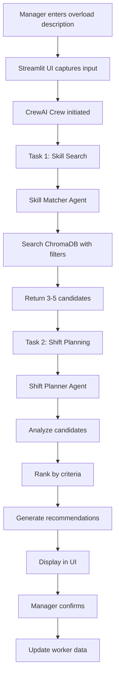
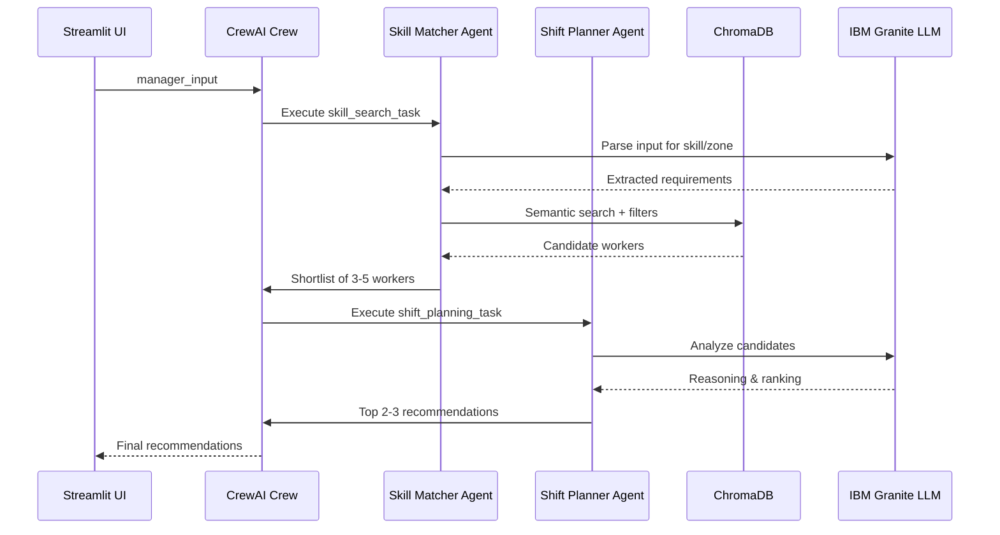

# SmartShift - Technical Implementation Guide
## Detailed Component Specifications & Workflows

---

## 🔄 System Workflow

### High-Level Flow



### Detailed Agent Workflow



---

## 📋 Detailed Component Specifications

### 1. workers.csv Structure

**Sample Row**:
```csv
W001,Ahmed Hassan,34,Forklift Operator,"Packing,Loading,Heavy Equipment","High school, Certified Forklift Technician","Fit, heavy lifting certified, no restrictions",Zone B,Packing,Morning,6AM-2PM,Low,40,Yes
```

**Data Generation Rules**:
- 28 workers total
- 7 workers per zone (A, B, C, D)
- Mix of ages: 22-58 years
- Diverse names (international)
- Each worker has 1 primary skill + 2-4 transferable skills
- Load distribution: 40% Low, 40% Medium, 20% High
- Availability: 90% Yes, 10% No
- Realistic education levels and certifications

**Skill Relationships** (for semantic matching):
- Forklift Operator ↔ Heavy Equipment Operator
- Packing Specialist ↔ Order Picker
- Loading Bay Operator ↔ Shipping Coordinator
- Quality Inspector ↔ Inventory Manager

---

### 2. config.py - LLM Configuration

**Purpose**: Centralized configuration for IBM Granite LLM

**Implementation**:
```python
"""
Configuration module for SmartShift.
Handles IBM watsonx.ai LLM setup and environment variables.
"""
import os
from crewai import LLM
from dotenv import load_dotenv

# Load environment variables
load_dotenv()

# IBM watsonx.ai Configuration
WATSONX_URL = "https://eu-de.ml.cloud.ibm.com"
WATSONX_API_KEY = os.environ.get("WATSONX_API_KEY")
WATSONX_PROJECT_ID = os.environ.get("WATSONX_PROJECT_ID")
WATSONX_MODEL_ID = "watsonx/ibm/granite-13b-chat-v2"

# Validate credentials
if not WATSONX_API_KEY or not WATSONX_PROJECT_ID:
    raise ValueError("WATSONX_API_KEY and WATSONX_PROJECT_ID must be set in .env file")

# Set environment variables for CrewAI
os.environ["WATSONX_URL"] = WATSONX_URL
os.environ["WATSONX_APIKEY"] = WATSONX_API_KEY
os.environ["WATSONX_PROJECT_ID"] = WATSONX_PROJECT_ID

# Initialize LLM
llm = LLM(
    model=WATSONX_MODEL_ID,
    base_url=WATSONX_URL,
    project_id=WATSONX_PROJECT_ID,
    max_tokens=2000,
    temperature=0.7
)

# ChromaDB Configuration
CHROMA_PERSIST_DIR = "./chroma_store"
CHROMA_COLLECTION_NAME = "warehouse_workers"

# Embedding Model
EMBEDDING_MODEL = "all-MiniLM-L6-v2"
```

---

### 3. data_loader.py - CSV Data Management

**Purpose**: Load, validate, and manage worker data

**Key Functions**:

```python
import pandas as pd
from typing import List, Dict, Optional

def load_workers(csv_path: str = "workers.csv") -> pd.DataFrame:
    """Load workers from CSV file."""
    df = pd.read_csv(csv_path)
    return df

def validate_workers(df: pd.DataFrame) -> bool:
    """Validate worker data integrity."""
    required_columns = [
        'worker_id', 'name', 'age', 'primary_skill',
        'transferable_skills', 'education', 'physicality',
        'current_zone', 'zone_function', 'shift', 'shift_hours',
        'load_status', 'load_percentage', 'available'
    ]
    return all(col in df.columns for col in required_columns)

def get_worker_by_id(df: pd.DataFrame, worker_id: str) -> Optional[Dict]:
    """Get worker by ID."""
    worker = df[df['worker_id'] == worker_id]
    if not worker.empty:
        return worker.iloc[0].to_dict()
    return None

def get_workers_by_zone(df: pd.DataFrame, zone: str) -> pd.DataFrame:
    """Filter workers by zone."""
    return df[df['current_zone'] == zone]

def get_available_workers(df: pd.DataFrame, exclude_zone: str = None) -> pd.DataFrame:
    """Get available workers, optionally excluding a zone."""
    available = df[df['available'] == 'Yes']
    if exclude_zone:
        available = available[available['current_zone'] != exclude_zone]
    return available

def parse_transferable_skills(skills_str: str) -> List[str]:
    """Parse comma-separated transferable skills."""
    return [s.strip() for s in skills_str.split(',')]
```

---

### 4. vector_store.py - ChromaDB Integration

**Purpose**: Semantic search using ChromaDB and sentence-transformers

**Implementation Strategy**:

```python
import chromadb
from chromadb.config import Settings
from sentence_transformers import SentenceTransformer
import pandas as pd
from typing import List, Dict
from config import CHROMA_PERSIST_DIR, CHROMA_COLLECTION_NAME, EMBEDDING_MODEL

class WorkerVectorStore:
    """ChromaDB vector store for worker skill matching."""
    
    def __init__(self):
        self.client = chromadb.Client(Settings(
            persist_directory=CHROMA_PERSIST_DIR,
            anonymized_telemetry=False
        ))
        self.embedding_model = SentenceTransformer(EMBEDDING_MODEL)
        self.collection = None
    
    def initialize_collection(self):
        """Create or get ChromaDB collection."""
        self.collection = self.client.get_or_create_collection(
            name=CHROMA_COLLECTION_NAME,
            metadata={"description": "Warehouse worker skills"}
        )
    
    def create_worker_document(self, worker: Dict) -> str:
        """Create searchable document from worker profile."""
        doc = f"""Worker {worker['name']}. 
        Primary skill: {worker['primary_skill']}. 
        Transferable skills: {worker['transferable_skills']}. 
        Education: {worker['education']}. 
        Physicality: {worker['physicality']}. 
        Zone: {worker['current_zone']}. 
        Available: {worker['available']}."""
        return doc
    
    def index_workers(self, workers_df: pd.DataFrame):
        """Index all workers in ChromaDB."""
        documents = []
        metadatas = []
        ids = []
        
        for _, worker in workers_df.iterrows():
            doc = self.create_worker_document(worker.to_dict())
            documents.append(doc)
            metadatas.append(worker.to_dict())
            ids.append(worker['worker_id'])
        
        # Generate embeddings
        embeddings = self.embedding_model.encode(documents).tolist()
        
        # Add to collection
        self.collection.add(
            documents=documents,
            embeddings=embeddings,
            metadatas=metadatas,
            ids=ids
        )
    
    def search_workers(
        self, 
        query: str, 
        exclude_zone: str = None,
        n_results: int = 5
    ) -> List[Dict]:
        """Search for workers matching query."""
        # Generate query embedding
        query_embedding = self.embedding_model.encode([query])[0].tolist()
        
        # Build where filter
        where_filter = {"available": "Yes"}
        if exclude_zone:
            where_filter["current_zone"] = {"$ne": exclude_zone}
        
        # Search
        results = self.collection.query(
            query_embeddings=[query_embedding],
            n_results=n_results,
            where=where_filter
        )
        
        return results['metadatas'][0] if results['metadatas'] else []
```

---

### 5. Custom Tools for Agents

**Purpose**: Provide agents with tools to interact with data

**Implementation**:

```python
from crewai_tools import tool
from vector_store import WorkerVectorStore
from data_loader import load_workers, get_worker_by_id

# Initialize vector store
vector_store = WorkerVectorStore()
workers_df = load_workers()

@tool("Search Workers Tool")
def search_workers_tool(query: str, exclude_zone: str = None) -> str:
    """
    Search for workers matching the skill query.
    
    Args:
        query: Natural language description of needed skill
        exclude_zone: Zone to exclude from results (e.g., "Zone A")
    
    Returns:
        JSON string of matching workers
    """
    results = vector_store.search_workers(query, exclude_zone)
    return str(results)

@tool("Get Worker Details Tool")
def get_worker_details_tool(worker_id: str) -> str:
    """
    Get full details of a specific worker.
    
    Args:
        worker_id: Worker ID (e.g., "W001")
    
    Returns:
        JSON string of worker details
    """
    worker = get_worker_by_id(workers_df, worker_id)
    return str(worker) if worker else "Worker not found"
```

---

### 6. agents.py - CrewAI Agent Definitions

**Purpose**: Define the two specialized agents

**Implementation**:

```python
from crewai import Agent
from config import llm
from tools import search_workers_tool

# Agent 1: Skill Matcher Agent
skill_matcher_agent = Agent(
    role="Warehouse Skill Search Specialist",
    goal="""Search the ChromaDB vector store to find workers whose primary or 
    transferable skills match the overload requirement. Filter out workers 
    already in the overloaded zone and those unavailable.""",
    backstory="""You are an expert in warehouse workforce management. You 
    understand that skills like 'forklift' and 'heavy equipment' are related, 
    and you find the best available talent efficiently. You always consider 
    transferable skills when matching workers to needs.""",
    tools=[search_workers_tool],
    llm=llm,
    verbose=True,
    allow_delegation=False
)

# Agent 2: Shift Planner Agent
shift_planner_agent = Agent(
    role="Warehouse Shift Planning Specialist",
    goal="""Take the candidates from Skill Matcher Agent and decide the top 2-3 
    best workers to recommend for rebalancing. Consider their education, 
    physicality, current load, and transferable skill relevance. Produce a 
    clear plain English explanation for each recommendation.""",
    backstory="""You are a seasoned warehouse operations manager. You make 
    fair, efficient staffing decisions based on worker capability and current 
    workload. You always explain your decisions clearly to the floor manager, 
    considering both the worker's qualifications and the impact on their 
    current zone.""",
    tools=[],  # Reasoning only
    llm=llm,
    verbose=True,
    allow_delegation=False
)
```

---

### 7. tasks.py - CrewAI Task Definitions

**Purpose**: Define the workflow tasks

**Implementation**:

```python
from crewai import Task
from agents import skill_matcher_agent, shift_planner_agent

def create_skill_search_task(manager_input: str) -> Task:
    """Create skill search task."""
    return Task(
        description=f"""Given the manager input: '{manager_input}', 
        identify the skill needed and search ChromaDB for workers who match.
        
        Steps:
        1. Parse the input to identify the overloaded zone
        2. Extract the skill requirement
        3. Use the search_workers_tool to find matching workers
        4. Filter out workers from the overloaded zone
        5. Return a shortlist of 3-5 candidates with their full profiles
        
        Return the candidates as a structured list with all their details.""",
        agent=skill_matcher_agent,
        expected_output="List of 3-5 candidate worker profiles with IDs, names, skills, zones, and availability"
    )

def create_shift_planning_task() -> Task:
    """Create shift planning task."""
    return Task(
        description="""Review the shortlisted candidates from the previous task.
        Pick the top 2-3 best workers to recommend for the shift change.
        
        For each worker, explain:
        - Why they are a good fit
        - What skill they bring (primary or transferable)
        - Their current zone and load status
        - Any relevant education or physicality notes
        - The impact of moving them
        
        Produce a final recommendation with clear reasoning that a warehouse 
        manager can understand and act upon immediately.""",
        agent=shift_planner_agent,
        expected_output="Top 2-3 ranked worker recommendations with detailed explanations and an updated shift plan"
    )
```

---

### 8. app.py - Streamlit UI Structure

**Purpose**: Interactive web interface

**Key Sections**:

1. **Header & Title**
2. **Current Workforce Overview** (DataFrame display)
3. **Overload Input Form** (text input + button)
4. **AI Recommendations** (cards with explanations)
5. **Shift Confirmation** (buttons for confirm/export)

**State Management**:
- Use `st.session_state` to track:
  - Current workers DataFrame
  - Recommendations
  - Confirmation status

---

## 🎯 Implementation Checklist

- [ ] Generate realistic workers.csv (28 workers)
- [ ] Implement config.py with LLM setup
- [ ] Implement data_loader.py with all functions
- [ ] Implement vector_store.py with ChromaDB
- [ ] Create custom tools (search_workers_tool)
- [ ] Implement agents.py (2 agents)
- [ ] Implement tasks.py (2 tasks)
- [ ] Implement app.py (Streamlit UI)
- [ ] Create requirements.txt
- [ ] Create .env.example
- [ ] Create .bobignore
- [ ] Write README.md
- [ ] Test with sample query
- [ ] Export Bob session reports

---

## 🧪 Testing Strategy

### Test Case 1: Basic Forklift Request
**Input**: "Zone A dispatch is overloaded, need forklift help"
**Expected**: Workers with forklift or heavy equipment skills from other zones

### Test Case 2: Transferable Skills
**Input**: "Zone C needs packing help for afternoon shift"
**Expected**: Workers with packing as primary or transferable skill, afternoon shift

### Test Case 3: Load Balancing
**Input**: "Zone B is at 90% capacity, need quality inspector"
**Expected**: Quality inspectors from low-load zones

---

**Status**: Ready for implementation
**Next Step**: Switch to Code mode to begin building